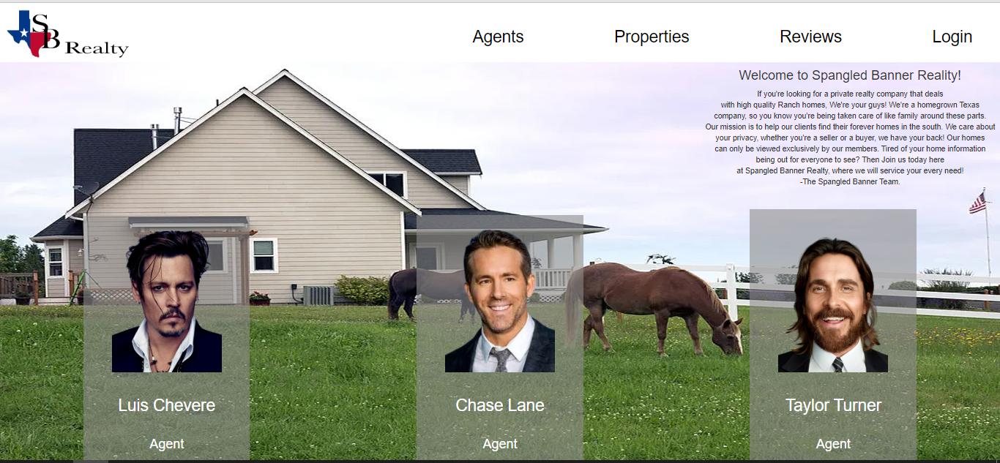

# SB Realty
A privatized realty company application


  ## Table of Contents
  - [User Story](#user-story)
  - [Description](#description)
  - [Installation](#installation)
  - [Usage](#usage)
  - [License](#license)
  - [Contributions](#contributions)
  - [Tests](#tests)

## User Story
```md
AS AN exclusive, high end ranch home real real estate agent 
I WANT a private website that I can display my listings on
SO THAT only serious buyers can see them once we're in contact
```

## Description
  This web application was design for clients who would like their privacy kept while selling or buying ranch realty.

  ## Installation
  To download the necessary dependencies please run the following command:
  - npm i 

  ## Usage
  This application utilizes technologies through a MySql database and Javascript stack with a back end 
  rendering through Handlebars templating. With html and css elements being manipulated through a 
  Bootstrap framework alongside vanilla CSS styling.

  ## Deployed App: [SB Realty Website](https://spangled-banner-realty.herokuapp.com/)
  

  ## Contributions
  - Luis Chevere: [@LuisChevere](https://github.com/LuisChevere) - Github

  - Chase Lane: [@ChaseLane](https://github.com/Chase-Lane) - Github

  - Taylor Turner: [@TaylorTurner](https://github.com/Bonee94) - Github
  
  If interested in contributing, please feel free to contact one of the contributors.

  ## Tests
  This application can be used in your browser.
  
  ## License
  This application uses the Unlicensed license.


  ## Questions
  Github: [@LuisChevere](https://github.com/LuisChevere)
  
  Email with any questions: Hairchevere@gmail.com

  
